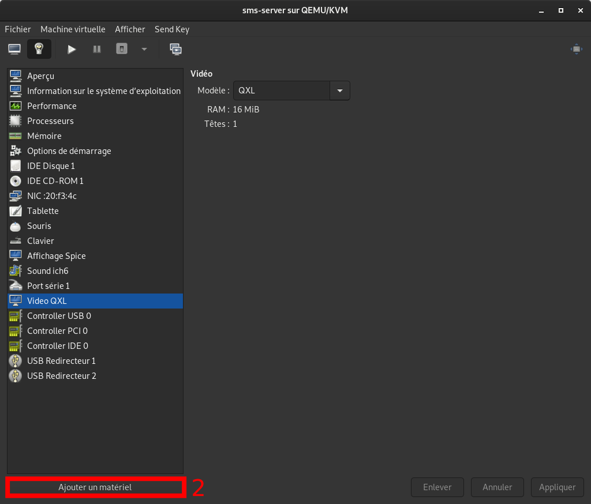
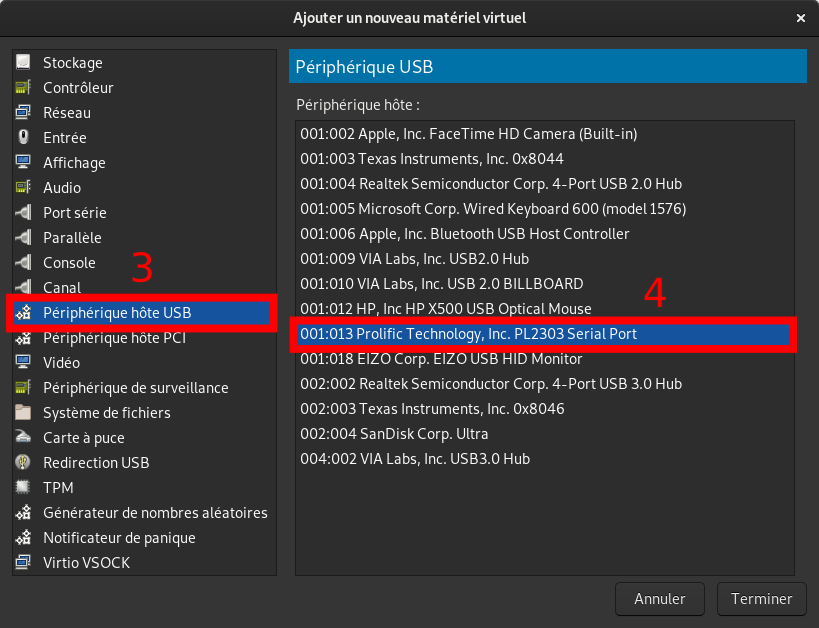

# Gammu

## Install
1. install package `gammu`
2. install package `gammu-smsd`
> install `gammu-smsd` if not in `gammu` package (depend on your distribution) 

## Configure

### Create config file for `gammu`

1. use command `gammu-detect` for get device info
2. create config file to `/etc/gammurc`
```sh
# This is a sample Gammu configuration file. It's required for gammu


[gammu]
device = /dev/ttyUSB0
name = Téléphone sur le port USB série Prolific_Technology_Inc.USB-Serial_Controller_D
connection = at
```
> `device= /dev/xxx` depends on the connection between your server and the device (use `gammu-detect` for get info)

### Create config file for `gammu-smsd`

1. use command `gammu-detect` for get device info
2. create config file to `/etc/gammu-smsdrc`
```sh
# This is a sample Gammu SMSD configuration file. It's required for gammu-smsd

[gammu]
device = /dev/ttyUSB0
name = Téléphone sur le port USB série Prolific_Technology_Inc.USB-Serial_Controller_D
connection = at

# SMSD configuration, see gammu-smsdrc(5)
[smsd]
service = files
LogFile = /var/log/gammu.log
# Increase for debugging information
DebugLevel = 0
# Change PIN code
#PIN = xxxxxxxx
# Change SMSC
#SMSC = xxxxxxxxxx
CommTimeout = 5
#CheckSecurity = 0
#RunOnReceive = /path_to_script.sh

# Paths where messages are stored
inboxpath = /var/spool/gammu/inbox/
outboxpath = /var/spool/gammu/outbox/
sentsmspath = /var/spool/gammu/sent/
errorsmspath = /var/spool/gammu/error/
```
> `device= /dev/xxx` depends on the connection between your server and the device

## Start

1. verify device is up with `gammu-detect`
2. start daemon if it is not started with `service gammu-smsd start`

>if you use only `gammu` command, `gammu-smsd` service is not required 

## Send SMS

you have 2 possibilities :
* send with `gammu` -> simple and fast
* send with `gammu-smsd` -> most complex, async and fail-safe

### Send with `gammu`

`gammu sendsms TEXT [TEL] -text [MESSAGE]`
> example : `gammu sendsms TEXT 0600000000 -text "Test 123"`

### Send with `gammu-smsd`

`gammu-smsd-inject TEXT [TEL] -text [MESSAGE]`
> example : `gammu-smsd-inject TEXT 0600000000 -text "Test 123"`

## Stop

stop daemon with `service gammu-smsd stop`

## USB passthrough

connect a device with a VM (use **KVM/QEMU**)





## File location

### config
* `/etc/gammurc`
* `/etc/gammu-smsdrc`

### spool
* `/var/spool/gammu/inbox`
* `/var/spool/gammu/outbox`
* `/var/spool/gammu/sent`
* `/var/spool/gammu/error`

### log
* `/var/log/gammu.log`
